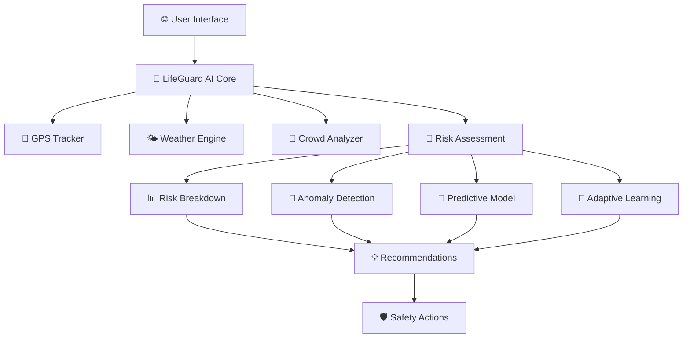

# 🛡️ LifeGuard AI - Advanced Real-Time Safety Intelligence System

<div align="center">


**🚀 Next-Generation AI-Powered Safety Monitoring System**

*Proactive risk prediction • Real-time environmental analysis • Intelligent safety guidance*

[🌟 Live Demo](#-live-demo) • [📖 Documentation](#-documentation) • [🚀 Quick Start](#-quick-start) • [🤝 Contributing](#-contributing)

</div>

---

## 🌟 **What is LifeGuard AI?**

LifeGuard AI is a cutting-edge, real-time safety intelligence system that uses advanced AI algorithms to predict and prevent dangerous situations before they escalate. Think of it as your personal safety guardian that never sleeps! 🌙✨

### 🎯 **Core Mission**
> *"Empowering people with intelligent safety insights to make informed decisions and stay protected in any environment."*

---

## ✨ **Key Features**

### 🧠 **Advanced GenAI Intelligence**
- 🤖 **Conversational AI Assistant** - Natural language interaction with intelligent safety guidance
- 🔮 **Predictive Risk Modeling** - Neural networks predict future scenarios up to 4 hours ahead
- 👁️ **Computer Vision Analysis** - Real-time visual hazard detection and crowd analysis
- 🗣️ **Adaptive Voice Interface** - Stress-aware speech recognition and synthesis
- 📊 **Behavioral Learning** - AI learns from user patterns and improves recommendations
- 🎭 **Scenario Generation** - Multiple future scenario analysis with confidence intervals

### 🔄 **Real-Time Intelligence**
- ⚡ **1-Second Updates** - Lightning-fast risk assessment refresh
- 🌍 **Live GPS Tracking** - High-accuracy positioning with movement detection
- 🌤️ **Weather Monitoring** - Real-time weather data with trend analysis
- 👥 **Crowd Analytics** - Smart crowd density estimation and flow patterns

### 🧠 **AI-Powered Analysis**
- 🤖 **Adaptive Learning** - System learns from outcomes and improves predictions
- 📊 **Risk Breakdown** - Detailed percentage contribution analysis
- 🚨 **Anomaly Detection** - Flags unusual patterns and sudden changes
- 🎯 **Predictive Modeling** - Forecasts risk changes over time

### 🎨 **Stunning Interface**
- 🌌 **Cyber-Themed Design** - Futuristic black theme with neon effects
- 📱 **Responsive Layout** - Works perfectly on all devices
- 🎭 **Matrix Animations** - Dynamic background effects
- 💫 **Real-Time Indicators** - Visual feedback for live data updates

### 🛠️ **Advanced Tools**
- 🎛️ **What-If Simulator** - Test different scenarios and conditions
- 📈 **Risk State Machine** - Intelligent behavior control system
- 🔍 **Micro-Decision Engine** - Updates confidence as actions are taken
- 🔒 **Privacy Protection** - Anonymized data aggregation with k-anonymity

---

## 🚀 **Quick Start**

### 📋 **Prerequisites**
- 🌐 Modern web browser (Chrome, Firefox, Safari, Edge)
- 📍 Location services enabled
- 🔑 API keys (optional but recommended):
  - [OpenWeatherMap API](https://openweathermap.org/api) for weather data
  - [Google Places API](https://developers.google.com/maps/documentation/places/web-service) for crowd analysis

### ⚡ **Installation**

1. **📥 Clone the Repository**
   ```bash
   git clone https://github.com/shraddha-chavan/LifeGuard-GenAI.git
   cd LifeGuard-GenAI/lifeguard-risk-monitor
   ```

2. **🚀 Start Local Server**
   ```bash
   # Using Python
   python -m http.server 8000
   
   # Or using Node.js
   npx serve .
   
   # Or using PHP
   php -S localhost:8000
   ```

3. **🌐 Open in Browser**
   ```
   # Main Application with Full GenAI Features
   http://localhost:8000/enhanced-index.html
   
   # GenAI Features Demo & Showcase
   http://localhost:8000/genai-demo.html
   ```

4. **⚙️ Configure API Keys** (Optional)
   - Click the ⚙️ Settings button
   - Add your API keys for enhanced accuracy
   - Adjust update frequencies as needed

---

## 📊 **System Architecture**



---

## 🎮 **Interactive Components**

### 🎛️ **Main Dashboard**
| Component | Description | Update Frequency |
|-----------|-------------|------------------|
| 🎯 **Risk Assessment** | Real-time risk scoring with visual indicators | 1 second |
| 🌍 **Environmental Data** | Weather, location, crowd, and time analysis | Variable |
| 💡 **AI Recommendations** | Intelligent safety suggestions | Real-time |
| 🚨 **Active Alerts** | Critical warnings and notifications | Instant |

### 🔧 **Advanced Tools**
- 🎲 **What-If Simulator** - Test scenarios with parameter sliders
- 📈 **Risk Breakdown Analyzer** - Detailed factor contribution analysis
- 🤖 **Adaptive Guidance Engine** - Stress-aware recommendation system
- 🔍 **Anomaly Detection Dashboard** - Pattern deviation monitoring

---

## 🧪 **Core Algorithms**

### 🎯 **Risk Assessment Engine**
```javascript
// Simplified risk calculation
function assessRisk(location, time, weather, crowd) {
    let riskScore = 0;
    
    // Weather impact (30% weight)
    riskScore += weatherRisk(weather) * 0.30;
    
    // Time-based risk (20% weight)
    riskScore += timeRisk(time) * 0.20;
    
    // Crowd density (25% weight)
    riskScore += crowdRisk(crowd) * 0.25;
    
    // Location factors (25% weight)
    riskScore += locationRisk(location) * 0.25;
    
    return classifyRisk(riskScore);
}
```

### 🤖 **Adaptive Learning System**
- 📚 **Historical Analysis** - Learns from past predictions vs outcomes
- ⚖️ **Weight Adjustment** - Dynamically adjusts factor importance
- 🎯 **Threshold Optimization** - Adapts risk level boundaries
- 🔄 **Continuous Improvement** - Gets smarter with each interaction

### 🚨 **Anomaly Detection**
- 📊 **Statistical Analysis** - Z-score based deviation detection
- 🔍 **Pattern Recognition** - Identifies unusual temporal patterns
- 🔗 **Correlation Analysis** - Detects unexpected factor relationships
- ⚡ **Real-Time Alerts** - Instant notifications for critical anomalies

---

## 📱 **Screenshots & Demo**

### 🖥️ **Main Dashboard**
<div align="center">


*Real-time risk monitoring with cyber-themed interface*

</div>

### 🎛️ **What-If Simulator**
<div align="center">


*Test different scenarios and see risk changes in real-time*

</div>

### 📊 **Risk Breakdown Analysis**
<div align="center">


*Comprehensive factor contribution analysis with visualizations*

</div>

---

## 🔧 **Configuration Options**

### ⚙️ **Real-Time Settings**
```javascript
const config = {
    refreshInterval: 1,           // Main update frequency (seconds)
    weatherUpdateFreq: 30,        // Weather data refresh (seconds)
    crowdUpdateFreq: 5,          // Crowd analysis refresh (seconds)
    highAccuracyGPS: true,       // Enhanced GPS precision
    riskSensitivity: 1.0,        // Risk calculation multiplier
    realTimeMode: true           // Enable continuous updates
};
```

### 🎨 **UI Customization**
- 🌈 **Theme Colors** - Customizable accent colors
- 📏 **Layout Options** - Responsive grid configurations
- 🎭 **Animation Settings** - Control visual effects intensity
- 📱 **Mobile Optimization** - Touch-friendly interface adaptations

---

## 🧩 **File Structure**

```
lifeguard-risk-monitor/
├── 📄 enhanced-index.html          # Main application interface
├── 🎨 enhanced-styles.css          # Cyber-themed styling
├── 🧠 enhanced-app.js              # Core application logic
├── ⚖️ simpleRiskAssessment.js      # Basic risk calculation
├── 🤖 genAI-engine.js              # Advanced GenAI intelligence engine
├── 💬 ai-chat-interface.js         # Conversational AI assistant
├── 🔮 predictive-ai-model.js       # Neural network predictions
├── 👁️ ai-vision-system.js          # Computer vision analysis
├── 🎪 genai-demo.html              # GenAI features demonstration
├── 🤖 adaptiveRiskEngine.js        # AI learning system
├── 📊 riskBreakdownAnalyzer.js     # Factor analysis engine
├── 🚨 anomalyDetector.js           # Pattern deviation detection
├── 🔮 riskSimulation.js            # Predictive modeling
├── 🎯 microDecisionEngine.js       # Confidence tracking
├── 🎛️ whatIfSimulator.js          # Scenario testing tool
├── 🎭 adaptiveGuidanceEngine.js    # Stress-aware recommendations
├── 🔒 anonymizedDataAggregator.js  # Privacy-preserving analytics
├── 🏛️ riskStateMachine.js         # Behavior control system
├── 📍 locationService.js           # GPS and location utilities
├── 🎲 whatIfDemo.html             # Interactive simulator demo
├── 🎨 adaptiveGuidanceDemo.html   # Guidance system demo
└── 📖 README.md                   # This documentation
```

---

## 🎯 **Use Cases**

### 🏃‍♂️ **Personal Safety**
- 🌃 **Night Walking** - Enhanced awareness in low-light conditions
- 🏔️ **Outdoor Activities** - Weather and terrain risk assessment
- 🏙️ **Urban Navigation** - Crowd and traffic safety analysis
- ✈️ **Travel Safety** - Location-based risk evaluation

### 👥 **Group Activities**
- 🎉 **Event Management** - Crowd flow and safety monitoring
- 🏫 **Educational Trips** - Student group safety tracking
- 🚌 **Transportation** - Route safety and condition analysis
- 🏢 **Workplace Safety** - Environmental hazard detection

### 🏛️ **Enterprise Applications**
- 🚨 **Emergency Response** - First responder decision support
- 🏗️ **Construction Sites** - Worker safety monitoring
- 🎪 **Event Venues** - Crowd management and safety
- 🚛 **Logistics** - Delivery route risk assessment

---

## 🔮 **Future Roadmap**

### 🚀 **Version 2.0 - Enhanced AI**
- [ ] 🧠 **Deep Learning Models** - Neural network risk prediction
- [ ] 🗣️ **Voice Commands** - Hands-free interaction
- [ ] 📱 **Mobile App** - Native iOS and Android applications
- [ ] 🌐 **Multi-Language** - International language support

### 🌟 **Version 3.0 - IoT Integration**
- [ ] 📡 **Sensor Networks** - Environmental sensor integration
- [ ] 🚗 **Vehicle Integration** - Automotive safety systems
- [ ] 🏠 **Smart Home** - Home automation safety features
- [ ] ⌚ **Wearable Devices** - Smartwatch and fitness tracker support

### 🔬 **Research & Development**
- [ ] 🧬 **Biometric Analysis** - Stress and health monitoring
- [ ] 🛰️ **Satellite Data** - Global environmental monitoring
- [ ] 🤝 **Social Networks** - Community-based safety insights
- [ ] 🔮 **Predictive Analytics** - Long-term trend forecasting

---

## 🤝 **Contributing**

We welcome contributions from the community! Here's how you can help:

### 🎯 **Ways to Contribute**
- 🐛 **Bug Reports** - Help us identify and fix issues
- 💡 **Feature Requests** - Suggest new capabilities
- 📝 **Documentation** - Improve guides and tutorials
- 🧪 **Testing** - Test new features and provide feedback
- 💻 **Code Contributions** - Submit pull requests

### 📋 **Development Setup**
1. 🍴 Fork the repository
2. 🌿 Create a feature branch (`git checkout -b feature/amazing-feature`)
3. 💻 Make your changes
4. ✅ Test thoroughly
5. 📝 Commit with descriptive messages (`git commit -m 'Add amazing feature'`)
6. 🚀 Push to your branch (`git push origin feature/amazing-feature`)
7. 🔄 Open a Pull Request

### 📏 **Code Standards**
- 📖 **Documentation** - Comment your code thoroughly
- 🧪 **Testing** - Include tests for new features
- 🎨 **Style** - Follow existing code formatting
- 🔒 **Security** - Consider privacy and security implications

---

## 📄 **License**

This project is licensed under the MIT License - see the [LICENSE](LICENSE) file for details.

```
MIT License

Copyright (c) 2024 LifeGuard AI Team

Permission is hereby granted, free of charge, to any person obtaining a copy
of this software and associated documentation files (the "Software"), to deal
in the Software without restriction, including without limitation the rights
to use, copy, modify, merge, publish, distribute, sublicense, and/or sell
copies of the Software, and to permit persons to whom the Software is
furnished to do so, subject to the following conditions:

The above copyright notice and this permission notice shall be included in all
copies or substantial portions of the Software.
```

---

## 🙏 **Acknowledgments**

### 🌟 **Special Thanks**
- 🤖 **AI Research Community** - For advancing safety AI technologies
- 🌍 **Open Source Contributors** - For building the tools we depend on
- 👥 **Beta Testers** - For providing valuable feedback and insights
- 🏛️ **Safety Organizations** - For guidance on best practices

### 🔧 **Built With**
- 🌐 **Vanilla JavaScript** - Core application logic
- 🎨 **CSS3** - Modern styling and animations
- 📊 **Chart.js** - Data visualization
- 🗺️ **Web APIs** - Geolocation, Weather, and Places
- 🎭 **Font Awesome** - Beautiful icons
- 🔤 **Google Fonts** - Typography (Orbitron, Rajdhani)

---

## 📞 **Support & Contact**

### 💬 **Get Help**
- 📧 **Email**: support@lifeguard-ai.com
- 💬 **Discord**: [Join our community](https://discord.gg/lifeguard-ai)
- 🐦 **Twitter**: [@LifeGuardAI](https://twitter.com/lifeguardai)
- 📖 **Documentation**: [docs.lifeguard-ai.com](https://docs.lifeguard-ai.com)

### 🚨 **Report Issues**
- 🐛 **Bug Reports**: [GitHub Issues](https://github.com/shraddha-chavan/LifeGuard-GenAI/issues)
- 🔒 **Security Issues**: security@lifeguard-ai.com
- 💡 **Feature Requests**: [GitHub Discussions](https://github.com/shraddha-chavan/LifeGuard-GenAI/discussions)

---

<div align="center">

## 🌟 **Star History**

[](https://star-history.com/#shraddha-chavan/LifeGuard-GenAI&Date)

---

### 🛡️ **Stay Safe, Stay Smart with LifeGuard AI** 🛡️

*Made with ❤️ by the LifeGuard AI Team*

**🌟 If this project helps keep you safe, please give it a star! 🌟**

[⬆️ Back to Top](#️-lifeguard-ai---advanced-real-time-safety-intelligence-system)

</div>

---

## 🎯 **Quick Links**

| 🔗 Link | 📝 Description |
|---------|----------------|
| [🏠 Main Dashboard](enhanced-index.html) | Primary application interface |
| [🎲 What-If Simulator](whatIfDemo.html) | Interactive scenario testing |
| [🎭 Adaptive Guidance](adaptiveGuidanceDemo.html) | Stress-aware recommendations |
| [📊 Risk Analysis](enhanced-index.html#risk-breakdown) | Detailed factor analysis |
| [⚙️ Configuration](enhanced-index.html#settings) | System settings panel |

---

*🌟 Last updated: December 2024 | Version: 1.0.0 | Status: 🟢 Active Development*